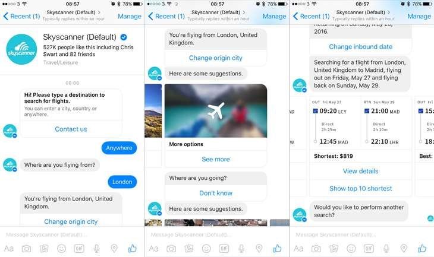
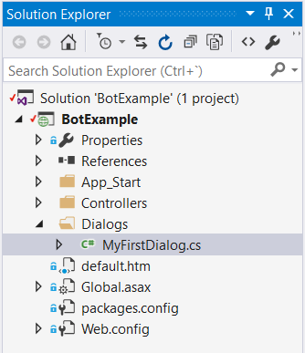
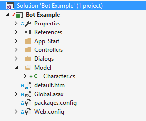
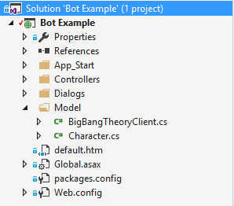
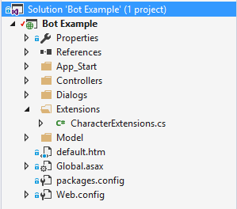

# Adding dialogs to our bot

## Welcome to Module 3!

If you have completed  [Module 1](https://github.com/DanyStinson/BigBotTheory/tree/master/Modules/Module-1) and  [Module 2](https://github.com/DanyStinson/BigBotTheory/tree/master/Modules/Module-2), you should have a working basic bot and have it published in the cloud.

If you haven´t completed the previous modules please do so, as they explain the basics of the **Bot Framework** project we are going to be using throughout the lab.

Here is a small resume of what this module is going to cover:

- Add basic dialog to our bot
- Create a welcome message
- Create an options menu
- Create the conversation for our bot to talk about his friends
- Create the conversation for our bot to talk about possible plans

## Add basic dialog to our bot

Normally, when you create a bot, you want it to have some type of interaction with the users who are going to use it, and depending on the finality you will want to model a conversation with the user. To accomplish it you can use **Dialogs**.
<div style="text-align:center" markdown="1">



</div>

[Dialogs](https://docs.botframework.com/en-us/csharp/builder/sdkreference/dialogs.html)
 are a conversational process, where the exchange of messages between bot and user is the primary channel for interaction with the outside world. Each dialog is an abstraction that encapsulates its own state in a C# class that implements [IDialog](https://docs.botframework.com/en-us/csharp/builder/sdkreference/dd/d5e/interface_microsoft_1_1_bot_1_1_builder_1_1_dialogs_1_1_i_dialog.html).

Let&#39;s see an example of a Dialog to understand it a bit better. If you have completed  [Module 1](https://github.com/DanyStinson/BigBotTheory/tree/master/Modules/Module-1) you can use the solution created, if not, you can use the solution provided in the [Start](https://github.com/DanyStinson/BigBotTheory/tree/master/Modules/Module-3/Start) folder of this Module.


Add a Dialogs folder in your solution where you will store your different types of Dialogs. Inside that folder create a new class file and name it whatever you want. In my case, I have named it **MyFirstDialog**.
<div style="text-align:center" markdown="1">



</div>

## Implementing IDialog

As explained before we are going to implement the IDialog interface to use botframework dialogs.

Update:
```
public class MyFirstDialog
{

}
```
To:

```
[Serializable]
public class MyFirstDialog: IDialog
{

}
```
>__Note__: You might need to include the following line in your namespaces as we are going to be working with Bot Builder Dialogs:
>```
>using Microsoft.Bot.Builder.Dialogs;
>```
><br>

Simply right click and tap  **Implement Interface** , which will add the following lines of code:

```
public async Task StartAsync(IDialogContext context)
{
    throw new NotImplementedException();
}
```

This is the entry point to our Dialog. Before we do anything else, we must first tell our bot to redirect to this dialog when it receives a message activity.

Go ahead to the **MessagesController.cs** file, delete everything inside
```
if (activity.Type == ActivityTypes.Message)
```
and add the following line:
```
await Conversation.SendAsync(activity, () => new MyFirstDialog());
```
Now, whenever our bot receives an initial message, the user will jump into __MyFirstDialog__ , or the dialog you specify.


## Creating a Welcome Message and Options Menu

Now we have our IDialog class implemented we are ready to create our dialog. Let´s add a welcome message to the user and see how dialogs work.

Delete the line inside __StartAsync__ method and insert the following lines
```
await context.PostAsync("Welcome, I'm Sheldon Bot");
context.Wait(MessageReceivedAsync);
```

>__Note:__ In Bot Framework we are going to use __Asynchrony__. For this reason, every time we use a method that awaits something, we have to specify it is an asynchronous method. 
><br>
><br>We do this by adding async this way:
>```
>public async Task FunctionnameAsync(<< parameters >>)
>```
><br>
Let´s stop a second and see what we have just added.

```
await context.PostAsync("Welcome, I'm Sheldon Bot");
```

With this statement, the bot sends a message to the user. In this case, we are returning a simple string message, but we can add attachments to messages which we´ll see later.

```
 context.Wait(MessageReceivedAsync);
```

After sending a message to the user we normally wait for an answer (as we would do in real life).

With the __context.Wait()__ method what we do is, wait for the users answer and send it to another function along with the context. Let´s call this new function __MessageReceivedAsync__ .

```
private async Task MessageReceivedAsync(IDialogContext context, IAwaitable<object> result)
{
}
```

As want to show the user an options menu once he has talked to the bot we don&#39;t really need his response for anything, so lets redirect this function to a __ShowOptions__ function to which we are going to pass our context.

Inside __MessageReceivedAsync__ add the following line and create the __ShowOptions__ function.
```
private async Task MessageReceivedAsync(IDialogContext context, IAwaitable<object> result)
{
    ShowOptions(context);
}

private void ShowOptions(IDialogContext context)
{
    var choices = new[] {"My Friends", "Tonight's Plan"};
    PromptDialog.Choice(context, ChoiceSelectedAsync, choices,"What do you want me to talk to you about?","Please select a valid option");
}
```
What we do with __PromptDialog.Choice__ is display a series of predefined choices for the user to pick what he wants to do, and send the selected choice to another function to process. We must define a message to display for the prompt, and another message in case the user decides to ask for an option that isn&#39;t in the list of choices.

More information and types of Prompts in the following [link](https://docs.botframework.com/en-us/csharp/builder/sdkreference/d9/d03/class\_microsoft\_1\_1\_bot\_1\_1\_builder\_1\_1\_dialogs\_1\_1\_prompt\_dialog.html).

>__Note__: As you can see we are recreating a conversation, we send a message, wait for the answer and process it to see what to reply next as we would do in real life conversations.

Let&#39;s create our ChoiceSelectedAsync function to process the user&#39;s choice. The argument parameter is the choice sent to this function so we await it and assign it to a variable named choice.
```
private async Task ChoiceSelectedAsync(IDialogContext context, IAwaitable<string> argument)
{
    var choice = await argument;
    switch (choice)
    {
        case "My Friends":
            break;
        case "Tonight's Plan":
            break;
        default:
            ShowOptions(context);
            break;
    }
}
```
## Creating the Friends conversation

Before we create the friend&#39;s conversation we should create a __Character__ class.

### **Character Model**

Go ahead and create a new Model folder in our folder and create the __Character.cs__ inside it.

<div style="text-align:center" markdown="1">



</div>

Update the code:
```
[Serializable]
public class Character
{
    public Character() { }

    public Character(string name, string profession, string information, string imageurl)
    {
        Name = name;
        Profession = profession;
        Information = information;
        Imageurl = imageurl;
    }

    public string Name { get; set; }

    public string Profession { get; set; }

    public string Information { get; set; }

    public string Imageurl { get; set; }

}
```

### **Character Database Client**

Normally we would have a database of characters somewhere in the cloud and a client through which connect to it. But in this lab, we are going to simulate this with a __Dictionary__ and a function to get __Characters__ from it.

Create a __BigBangTheoryClient__ class inside the __Model__ folder. 

<div style="text-align:center" markdown="1">



</div>
Next add the dictionary and populate it.

```
private Dictionary<string, Character> characters = new Dictionary<string, Character>()
{
 {"leonard", new Character("Leonard Hofstadter", "Experimental Physicist" ," <<insert information text here>>", "<<insert image internet Url here>>")},
 {"penny", new Character("Penny", "Aspiring Actress" , " <<insert information text here>>" , "<<insert image internet Url here>>")},
 {"raj", new Character("Rajesh Koothrappali", "Particle Astrophysicist" , " <<insert information text here>>" , "<<insert image internet Url here>>")},
 {"howard", new Character("Howard Wolowitz", "Aerospace Engineer" , " <<insert information text here>>", "<<insert image internet Url here>>")}
};
```
>__Note:__ You can always add more characters if you want, this is just a small demonstration on how to create the dictionary.

Once created the dictionary, we need a method to retrieve the wanted Character object from the dictionary. Add the following code after the dictionary:
```
public Character GetCharacter(string name)
    => characters.ContainsKey(name.ToLower()) ? characters[name.ToLower()] : null;
```
Now when we call __BigBangTheoryClient.GetCharacter(<< name of character >>)__ it will return __Character__ if it&#39;s found in the dictionary and __null__ if it fails to find it.

### **Friend Selection**

When we have a __Character class__ and a __Character client__ we can go back to __MyFirstDialog.cs__ and update the __ChoiceSelectedAsync()__ switch.

Add the following code:
```
case "My Friends":
  var choices = new[] { "Leonard", "Penny", "Howard", "Raj" };
  PromptDialog.Choice(context, FriendSelectedAsync, choices, "Who do you want to know about?", "Please select a valid option");
  break;
```
Now the user can select a friend to get information from. Go ahead and create the __FriendSelectedAsync__ method to give the user some information about the character selected.
```
private async Task FriendSelectedAsync(IDialogContext context, IAwaitable<string> argument)
{
    var choice = await argument;
    var character = new BigBangTheoryClient().GetCharacter(choice);
    if (character != null)
    {
        await context.PostAsync($"{choice}`s profession is {character.Profession}.");
    }
    else
    {
        await context.PostAsync($"Sorry, {choice} isn't in my friends list");
    }

    ShowOptions(context);
}
```

Go ahead and try out your bot with the __Bot Framework Emulator__! 

>__Note:__ Remember "Tonight`s plans" choice isn´t available yet.


### **Friend´s Hero Card**

Right now, when we ask our bot for information of a Character, it returns its profession. We could do the same thing for his or her name or more information.

But wouldn´t it be cool to show all the information we have about a character and show its picture? Well, we can do this with a type of message attachment called HeroCard.

<div style="text-align:center" markdown="1">


</div>

Let´s create an extension method for the Character class. This way we can return a Hero Card for each character when we need it.

Create a new __Extensions folder__ and create a ***static*** __CharacterExtensions__ class inside and add the following code.

<div style="text-align:center" markdown="1">



</div>

```

public static Attachment ToAttachment(this Character character, IDialogContext context)
{
    HeroCard hc = new HeroCard()
    {
        Title = character.Name,
        Subtitle = character.Profession,
        Text = character.Information,
        Images = new List<CardImage>()
        {
            new CardImage()
            {
                Url = character.Imageurl
            }
        }
    };

    return hc.ToAttachment();
}


public static IMessageActivity ToMessage(this Character character, IDialogContext context)
{
    var reply = context.MakeMessage();
    reply.Attachments = new List<Attachment>
    {
        character.ToAttachment(context)
    };

    return reply;
}
```

Now our __Character__ class has a new method that will return a reply with a __HeroCard__ containing all the characters information.

Let´s go back to our __FriendSelectedAsync__ method in our dialog and update:
```
await context.PostAsync($"{choice}`s profession is {character.Profession}.");
```
to:
```
await context.PostAsync(character.ToMessage(context));
```
### __Try your bot and see the results!__

## Creating the Plans conversation

For this part of the bot`s conversation we won&#39;t need to create a Plan model, as we will only return a string.

What we do need, is to simulate the database client as we did in the friend&#39;s conversation. Go ahead an add the following code to __BigBangTheoryClient.cs__:

```
private Dictionary<string, string> plans = new Dictionary<string, string>()
{
    { "monday", "get a Thai takeout!" },
    { "tuesday", "have a cheeseburger at the Cheesecake Factory!" },
    { "wednesday", "play Halo with your friends!" },
    { "thursday", "have a nice slice of pizza!" },
    { "friday", "get a chinese takeaway!" },
    { "saturday", "do some of your laundry!" },
    { "sunday", "relax at home and do some physics!" }
};

public string GetPlan(string dayOfWeek)
    => plans.ContainsKey(dayOfWeek.ToLower()) ? plans[dayOfWeek.ToLower()] : null;
```

Now when we call __BigBangTheoryClient.GetPlan(<< name of day >>)__ it will return the plan for the day required.

**Day Selection**

When we have a __Plans Dictionary__ in our client we can go back to MyFirstDialog.cs and update ChoiceSelectedAsync() switch.

Add the following code:
```
case "Tonight's Plan":
PromptDialog.Text(context, ReturnPlanAsync, "What day of the week is today?", "Please enter the name of the day", 3);
break;
```
In this case, we don´t display a series of options to the user. Instead, we ask the user to send the bot the day.

Create the __ReturnPlanAsync__ function to return a plan for the day required by the user.
```
private async Task ReturnPlanAsync(IDialogContext context, IAwaitable<string> argument)
{
    var choice = await argument;
    var plan = new BigBangTheoryClient().GetPlan(choice);
    if (plan != null)
    {
        await context.PostAsync($"If today is {choice} you should {plan}");
    }
    else
    {
        await context.PostAsync($"Sorry, {choice} isn't a day of my week");
    }

    ShowOptions(context);
}
```

### __Go ahead and ask your bot what to do today!__

## That&#39;s the end for Module 3.

Let´s recap a little.

In this module, you have learned the __basics of bot Dialogs__. You can now create bots that:

- Display a welcome message.
- Prompt a series of options for a user to select.
- Ask users for a string.
- Return normal messages as a reply.
- Return HeroCards as attachments of messages.

Continue to  [Module 4](https://github.com/DanyStinson/BigBotTheory/tree/master/Modules/Module-4) to add intelligence to your bots dialog with LUIS cognitive service!

