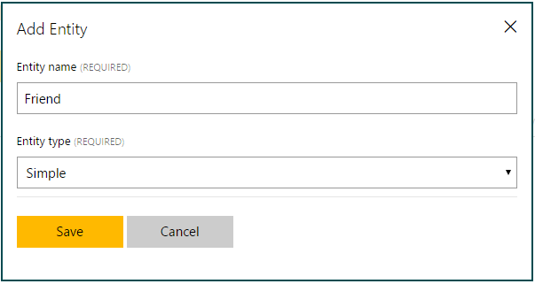
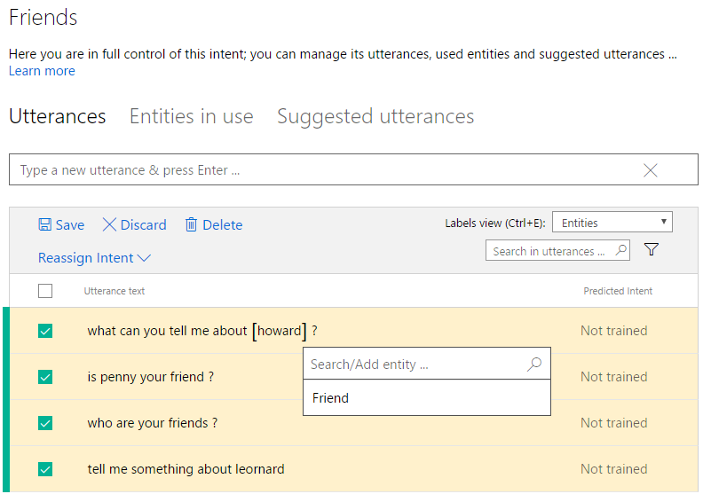
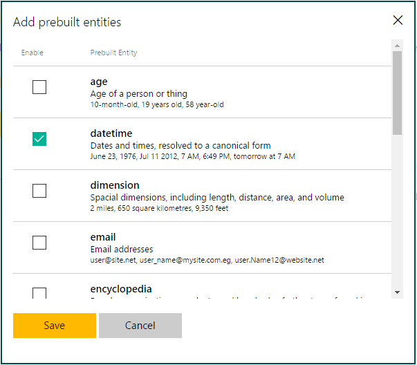
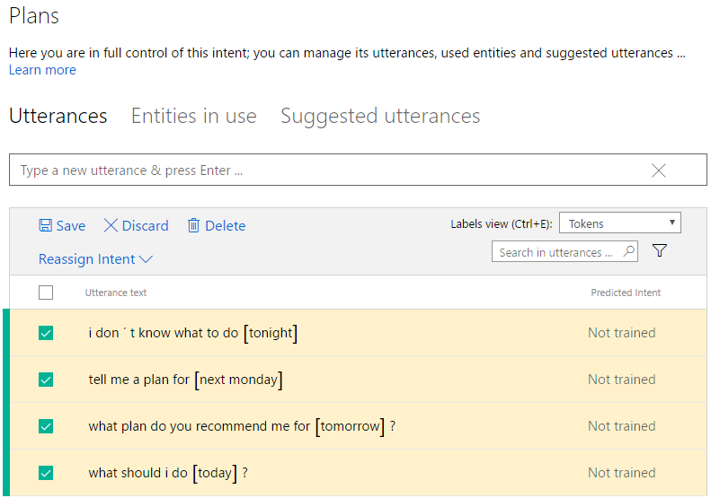
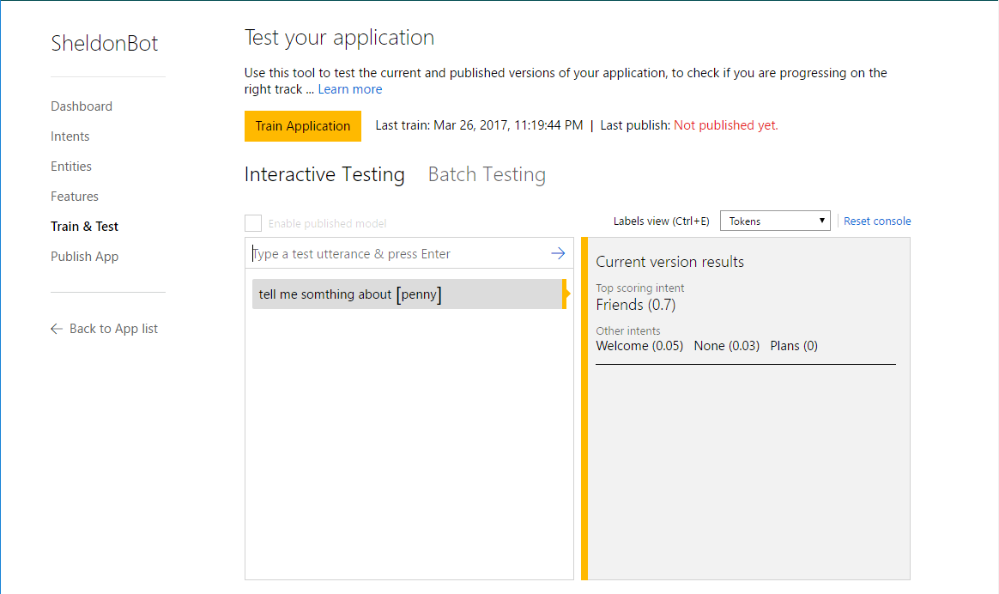
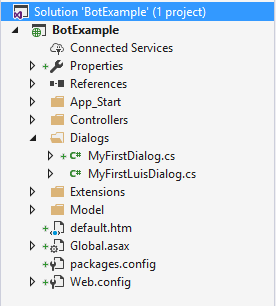
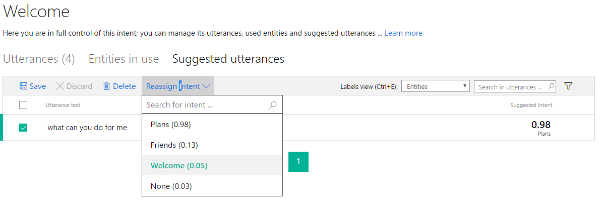
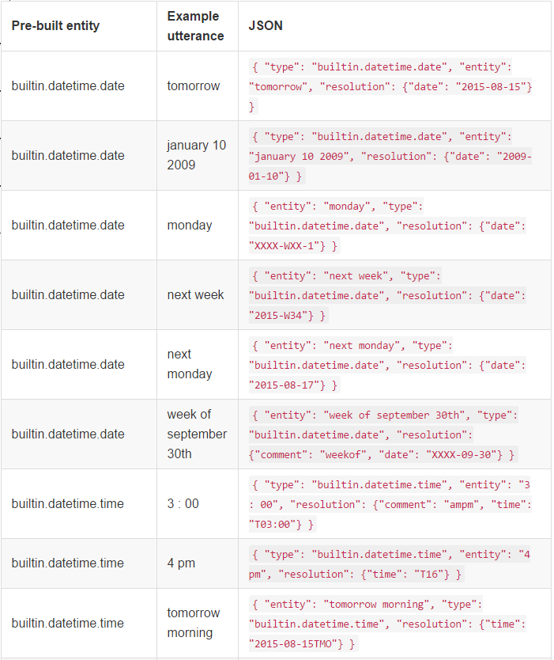

# Adding Intelligence To Our Bot
## Welcome to Module 4

If you have completed [Module 1](https://github.com/DanyStinson/BigBotTheory/tree/master/Modules/Module-1), [Module 2](https://github.com/DanyStinson/BigBotTheory/tree/master/Modules/Module-2) and [Module 3](https://github.com/DanyStinson/BigBotTheory/tree/master/Modules/Module-3), you should have a working bot, with a dialog that asks the user whether he wants to know about your bot´s friends or what plan does it recommend for a specific day of the week.

If you have followed the three modules you can still use the same bot, if you are starting from this module, you can download the solution I have left in the __Start__ folder of this module.
>__Note:__ If you download the Start folder remember to populate the dictionaries located in the __BigBangTheoryClient.cs__ file inside the __Model__ folder.

Here is a small resume of what this module is going to cover:
- Understanding LUIS
- Create a LUIS service for our bot
- Add a LUIS dialog to our bot
- Create the LUIS conversation for our bot to talk about his friends
- Create the LUIS conversation for our bot to talk about possible plans

## Understanding LUIS

Up to now we have created a bot that displays options for the user to pick and process the selection to return an answer. Okay, that’s cool, but kind of traditional. Let´s admit it, it can get boring following always the same dialog routine. 

Wouldn`t it be better to ask the bot in natural language what we want from it, __just like we would do in real life__? 

That would be awesome, but we would have to parse all the different ways of asking for a specific service from the bot. Let me show you an example:

If I want to know about the weather today I could ask:
-	What’s the weather today?
-	Is it warm outside?
-	Should I take an umbrella if I go out tonight?

We could go on and on… And I don´t think anyone is going to waste time parsing every single way of asking and looking for __relevant data__ in each phrase to extract the __intention__ of our request. So, what can we do to solve this?

Here is where __LUIS__ comes in.

__Language Understanding Intelligent Service (LUIS)__ is a Microsoft Cognitive Service designed to enable developers to build smart applications that can understand human language intentions and accordingly react to user requests.

Let me explain to you how LUIS works as we create the service for our Bot.
## Create a LUIS service for our bot
Go to the LUIS web page and create a new account using your Microsoft account.


>__Note:__ It might take a while to create your account.

LUIS API needs an __endpoint key__. Go to “My Keys” Section and add a new Key, you can use your __programmatic key__ for this lab.


Now you have an __endpoint key__ you can create your first LUIS app in the __My Apps__ Section.


If everyhing has gone right, this is your app dashboard you should be seeing right now.
>__Note:__ The _App Id_ next to __Dashboard__ will be your __LUIS ID__. 


## LUIS basics

We`ve created an app, lets see how LUIS works.

As I explained to you before, LUIS is going to recognize the users request intention. If we look at our current bot, we could extract four basic intentions:
- __None:__ In case LUIS doesn´t detect any intention.
- __Welcome:__ It´s always nice to say hello to our bot!.
- __Friends:__ We want to know information about the bots friends.
- __Plans:__ We want the bot to recommend us a plan.

When we want LUIS to recognize an intention we add a new Intent.
### __None Intent__

As you can see, when you create your LUIS app, the None intention already comes prebuilt, so we don`t have to worry about this part.


Whenever LUIS doesn´t recognize any of the intentions we have are going to define (Welcome, Friends or Plans), it will assign it to the None Intent. 

### __Welcome Intent__

Go to the intents Section and add a new “Welcome” intent.


Right now, our bot doesn´t have any knowledge about what the welcome intent is referred to, so let’s add different ways (utterances) of how we would say Hello to our bot.


Once you typed in a few utterances press __Save__. Now our bot has utterances examples for the __Welcome Intent__.

### __Friends Intent__

Before we create the __Friends Intent__ I want to explain you something.

When we ask our bot about his friends it will recognize the intention. But wouldn´t it be nice for it to know which friend we are referring to also? 


Here is where __LUIS Entities__ come in. 

__Entities__ are key data in your application’s domain. An entity represents a class including a collection of similar objects (places, things, people, events or concepts). They describe information relevant to the intent, and sometimes they are essential for your app to perform its task.

Let me show you an example. If we ask:

_What can you tell me about Leonard?_

- The intention of this request is to know about the bot`s __Friends__. 

- __Leonard__ would be a __Friend Entity__ for this intent.

Go to the Entities Section and add a new Custom Entity.



Once created lets go back to our Intents Section, create a new __Friends Intent__ and add a couple of utterances.

When you have populated a bit your utterances, place your mouse over your Friends entities (in the utterance) and assign the entity to the selected word (or words). When you finish, remember to __Save__ your utterances. Once we train our bot, it will be able to recognize the entities itself!!



### __Plans Intent__

 In the case of the __Plans__ intent we should tell the bot to recognize the date in the utterance. Lucky for us we don't have to create a new Entity and train the bot to detect it, __the LUIS team have already taken care of that!__

 LUIS comes with a series of __Pre-Built Entities__ such as __Email, Geography, Money, Numbers, Datetime, Temperature and many more!__

For this intent we are going to use the __DateTime Entity__, so our bot knows what day the user wants the plan recommendation.

Go to the __Entities__ Section and create the datetime prebuilt entity.



If you go back to the __Intents Section__, create a __Plans Intent__ and populate it with utterances as you already know. You will see that LUIS will detect the datetime entities for you! Pretty cool huh?



### __LUIS Training__

Up to now we have given our bot a set of utterances and entities for different Intents. If we train the bot, it will quickly start recognizing itself the new examples we seed it. 

Go to the __Test & Train__ Section and press the __Train Application__ button to train your bot with the examples we gave it before.



You also have a __Testing Panel__ in this section where you can enter utterances and see what your bot is capable of understanding. If the bot doesn`t detect an intent right you can go back to the Intents Section, add the new utterance in the correct Intent and train it again.

### __LUIS Publishing__

When you finish building and testing your app, you can publish your it as webservice and get an HTTP endpoint that can be integrated in any backend code.

Go to the __Publish App__ Section, select your __Programmatic Key__ as _endpoint key_ and press the __Publish__ button.


### __Congratulations, you have created your first LUIS app!__  

## Adding LUIS Dialog to our bot

Now you have your LUIS app working it`s time to bind it with our existing bot.

Open the Visual Studio Solution and create a __MyFirstLuisDialog.cs__ inside the __Dialogs__ folder.



### __LuisDialog implementation__

In [Module 3](https://github.com/DanyStinson/BigBotTheory/tree/master/Modules/Module-3) we learned used the __IDialog__ implementation to encapsulate our dialog. In this case LUIS has its own dialog, __LuisDialog__.

Update:
```
public class MyFirstLuisDialog
{
       
}
```

to:

```
[Serializable]
public class MyFirstLuisDialog : LuisDialog<object>
{
   public MyFirstLuisDialog(LuisService service) : base(service) { }
}
```

### __Setting up LUIS keys__

Next, we have to tell our bot the settings of our LUIS endpoint to use the service.

Go to the __Web.config__ file, and add two new keys inside the AppSettings we created in [Module 2](https://github.com/DanyStinson/BigBotTheory/tree/master/Modules/Module-2). 

```
<add key="LUISModelID" value="Put your LUIS App ID here"/>
<add key="LUISSubscriptionKey" value="Put your LUIS key here" />
``` 

Now when a user writes a message to the bot, we want it to jump into our LUIS dialog, so go ahead and update the code in the __MessagesController.cs__ inside the __Controllers__ folder.


```
if (activity.Type == ActivityTypes.Message)
            {
                var attributes = new LuisModelAttribute(
                    ConfigurationManager.AppSettings["LUISModelID"], 
                    ConfigurationManager.AppSettings["LUISSubscriptionKey"]);
                var service = new LuisService(attributes);
                await Conversation.SendAsync(activity, () => new MyFirstLuisDialog(service));
            }
```

### __LUIS Welcome Intent__

So, we have linked our LUIS app to our LUIS Dialog, but how do we tell our bot __what to do__ when LUIS reconizes an intention?

We can define what our bot should do everytime it detects someone is saying "Hello" or something similar to it by adding the following lines to __MyFirstLuisDialog.cs__:

```
//We define our LUIS entity
[LuisIntent("Welcome")]
// We define the function we want to execute
public async Task WelcomeAsync(IDialogContext context, LuisResult result)
{
    await context.PostAsync($"Hi, I'm SheldonBot");
    await context.PostAsync("I can talk about my friends or weekly night plans, what would you like to know?");
    context.Wait(MessageReceived);
}
```
Whenever our users write a message to our bot and LUIS recognizes it as a __Welcome__ intent, it will perform the __Welcome function__ and present himself.

Everytime LUIS identifies an intent it returns a __LuisResult__ variable containing all the data related to the intention.

>__Note:__ __MessageReceived__ is a function already included in LuisDialog that we use to wait for the users message. This function receives the users message and passes it to the LUIS service to indentify possible intents.

### __LUIS None Intent__

Sometimes LUIS won´t detect an utterance we pass it, for these cases, we have the None intent.
Add the following code to the dialog:
```
[LuisIntent("")]
public async Task NoneAsync(IDialogContext context, LuisResult result)
{
    await context.PostAsync($"Sorry, I did not understand '{result.Query}'");
    await context.PostAsync("I can talk about my friends or weekly night plans, what would you like to know?");
    context.Wait(MessageReceived);
}
```

Whenever LUIS doesn´t recognize an intent or classifies it wrong, we can go back to our LUIS service and reassign the utterance intent. 

To do this head, back to the __Intent__ Section, select any intent and go to the __Suggested Utterances__ Section.



Whenever LUIS is used through our bot, all the utterances are going to store themselves in the __Suggested Utterances__ section. This way we can save the correct intents LUIS has detected and __Reassign__ the incorrect ones.

After saving the correct utterances don´t forget to train again your LUIS so it becomes more intelligent.

### __LUIS Friends Intent__

Let´s start the friends conversation by adding a new LUIS intent inside our dialog. I have also included the BigBangTheoryClient client, as we are going to be working with the Characters Dictionary we used in Module 3.

```
[LuisIntent("Friends")]
public async Task FriendsAsync(IDialogContext context, LuisResult result)
{
    var client = new BigBangTheoryClient();
}
```

The bot is going to execute this function when LUIS detects we are asking about the bot`s friends. 
### __Extracting the Friend Entity__
If you remember, we also created a Friend entity in case we are asking for information about a specific friend. 

To extract an __Entity__ we must first check if the requested Entity is found in the utterance and dump it into an __EntityRecommendation__ variable. 

So let´s find a Friend Entity by adding the following code after the client declaration.


```
// Did we get a friend name?
EntityRecommendation friendEntRec;
    if (result.TryFindEntity("Friend", out friendEntRec))
        {
            // We got a name
            string friend = friendEntRec.Entity;
            var character = client.GetCharacter(friend);
            if (character != null)
                {
                    // We know the friend
                    await context.PostAsync($"This is what I can tell you about {character.Name}");
                    await context.PostAsync(character.ToMessage(context));
                }
            else
                {
                    // We don't know the friend
                    await context.PostAsync($"Sorry, {friend} isn't in my friends list");
                }
        }
    else
    {
        // We weren't provided with any friend name
        await context.PostAsync($"You haven´t asked me about any specific friend");
    }

    context.Wait(MessageReceived);

```

For those who completed Module 3 what we do in this function will be familiar to them. If you haven`t done Module 3, what we do in this function is:
- Search the friend received in our __Friends Dictionary__.
- If the friend is found, we return a reply with a __Hero Card__ attachment we created with an __extension method__ for the __Character__ class (You can see this in the __Extensions__ folder of the project).
- If the friend is not found we return a reply telling the user the friend isn´t in his list.
- If we don´t detect any friend entity we inform the user
- Finally we wait for the users next message with __context.Wait(MessageReceived)__

### __Go ahead and ask your bot about his friends!__

### __Returning the Hero Card Carousel__

Let´s add a new feature to the Friends conversation. To let the user know the available friends of the bot, we are going to reply with a __carousel of Character Hero Cards__ whenever we don`t indentify a Friend entity or we don´t find the friend in the dictionary.

First let`s create a new method in our __BigBangTheoryCient.cs__ to return a list, with all the characters in the dictionary, using __LINQ__.

```
public IEnumerable<Character> GetAllCharacters()
    => characters.Select(c => c.Value).ToList();
```

Once we have a list of characters we want to transform them into HeroCards and return a __carousel__ containing all the cards. To create the reply with the carousel, add the following method in our __CharacterExtensions.cs__:

```
public static IMessageActivity ToMessage(this IEnumerable<Character> characters, IDialogContext context)
{
    var reply = context.MakeMessage();
    reply.AttachmentLayout = "carousel";
    reply.Attachments = characters.Select(c => c.ToAttachment(context)).ToList();
    return reply;
} 
```
Go back to the LuisDialog and update the friends conversation. 
```
[LuisIntent("Friends")]
public async Task Friends(IDialogContext context, LuisResult result)
{
    var client = new BigBangTheoryClient();

    // Did we get a friend name?
    EntityRecommendation friendEntRec;
    if (result.TryFindEntity("Friend", out friendEntRec))
    {
        // We got a name
        string friend = friendEntRec.Entity;
        var character = client.GetCharacter(friend);
        if (character != null)
        {
            // We know the friend
            await context.PostAsync($"This is what I can tell you about {character.Name}");
            await context.PostAsync(character.ToMessage(context));
        }
        else
        {
            // We don't know the friend
            await context.PostAsync($"Sorry, {friend} isn't in my friends list");
            var characters = client.GetAllCharacters();
            await context.PostAsync(characters.ToMessage(context));
        }
    }
    else
    {
        // We weren't provided with any friend name
        await context.PostAsync($"Here are some of my friends");
        var characters = client.GetAllCharacters();
        await context.PostAsync(characters.ToMessage(context));
    }

    context.Wait(MessageReceived);
}
```

Now ours users will see all the bots friends in a nice way.

### __Talk with your bot and see your progress!__

### __LUIS Plans Intent__

>__Resume:__ In this section our goal is to return the plan recommended for a day like we did in Module 3. The advantage of implementing LUIS is not having to ask the user for a day, instead we are going to extract the datetime prebuilt entity we assigned to this intent and parse it obtaining the day of the week the user is referring to.

Create the LUIS intent and corresponding function the same way we did with the other intents.

```
[LuisIntent("Plans")]
public async Task PlansAsync(IDialogContext context, LuisResult result)
{
    
}
```

Datetime entities detect dates or time, so we have to distinguish the result obtained. Add the following code inside the Plans function to retrieve the Entity.

```
string datetime = string.Empty;
EntityRecommendation dateEntRec;
if (result.TryFindEntity("builtin.datetime.date", out dateEntRec))
{
    datetime = dateEntRec.Resolution["date"];
}

else if (result.TryFindEntity("builtin.datetime.time", out dateEntRec))
{
    datetime = dateEntRec.Resolution["time"];
}

```
To understand a bit better what LUIS returns when a datetime Entity is found here is a table with the different utterances it detects:



### __Obtaining the DayOfWeek__

Right now our datetime variable contains a value like "2017-03-28" or "XXXX-WXX-1" depending on the datetime entity detected. If you remember our __Plans Dictionary__ accepts the name of week days as keys, so we have to parse _datetime_ to a DayOfWeek object in order to retrieve the plan from the dictionary.

To accomplish this, lets create an extension method for the __String__ class, to transform its value into a DayOfWeek object, add the following code:

```
public static class StringExtensions
    {
        public static DayOfWeek GetDayOfWeek(this string datetime)
        {
            DayOfWeek? day;
            DateTimeResolution resolution;
            if (DateTimeResolution.TryParse(datetime, out resolution))
            {
                day = resolution.DayOfWeek;
                DayOfWeek dayOfWeek;
                if (day != null)
                {
                    dayOfWeek = day.Value;
                }
                else
                {
                    if (resolution.Year.HasValue && resolution.Month.HasValue && resolution.Day.HasValue)
                    {
                        dayOfWeek = new DateTime(resolution.Year.Value, resolution.Month.Value, resolution.Day.Value).DayOfWeek;
                    }
                    else
                    {
                        dayOfWeek = DateTime.Now.DayOfWeek;
                    }
                }
                return dayOfWeek;
            }
            else
            {
                return DateTime.Now.DayOfWeek;
            }
        }
    }
```

Now, every time we parse the datetime variable we`ll get a __DayOfWeek__ object.

### __Returning the plan__

Let´s finish updating the __Plans__ function so our bot returns us the plan. Add the following code after the _if else_ statement.

```
var dayOfWeek = datetime.GetDayOfWeek();

var plan = new BigBangTheoryClient().GetPlan(dayOfWeek.ToString());
await context.PostAsync($"On a {dayOfWeek} you should {plan} ");
context.Wait(MessageReceived);

```
### __Go ahead and ask your bot what to do tomorrow night!__

## That&#39;s the end for Module 4.

Let´s recap a little.

In this module, you have learnt the __basics of LUIS and LuisDialogs__. You can now create bots that:

- Recognize user intentions.
- Recognize entities in those intentions.
- Perform a specific task for each intention
- Return a carousel of HeroCards.
- Parse datetime string to DayOfWeeks.

Continue to  [Module 5](https://github.com/DanyStinson/BigBotTheory/tree/master/Modules/Module-5) to add image recognition cognitive services to your bot!


