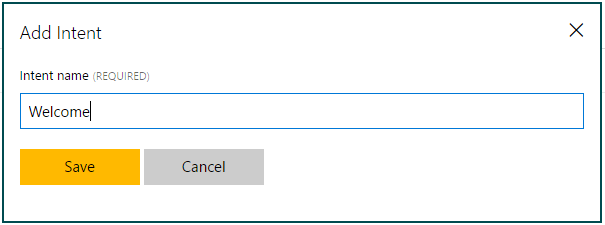
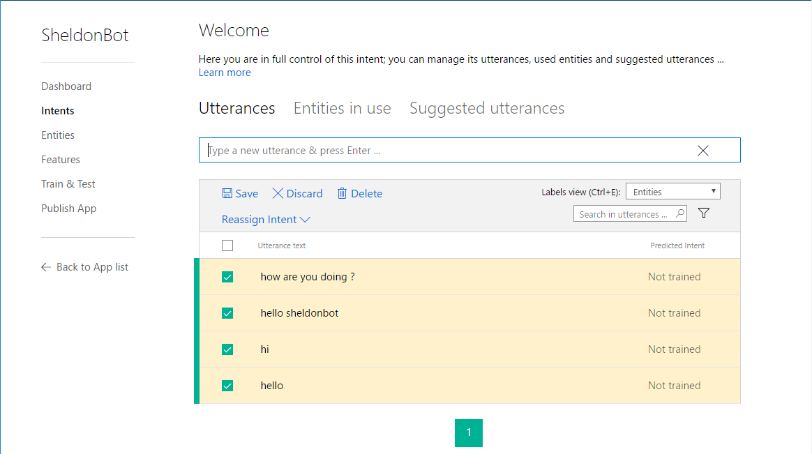
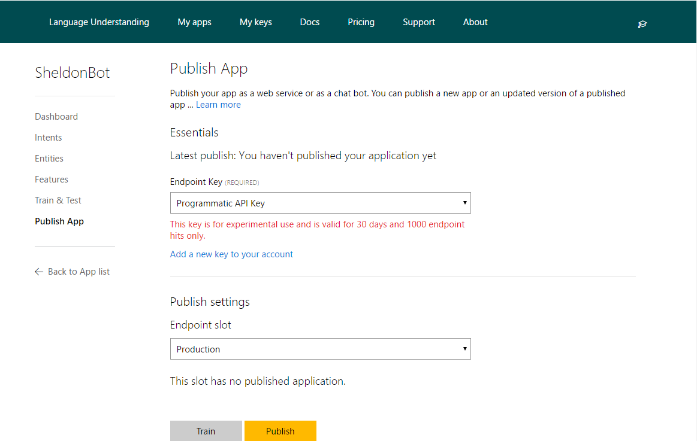

# Adding Intelligence to Our Bot
## Welcome to Module 4

If you have completed Module 1, Module 2 and Module 3, you should have a working bot, with a dialog that asks the user whether he wants to know about your bots friends or what plan does the bot recommend for a specific day of the week.

If you have followed the three modules you can still use the same bot, if you are starting from this module, you can download the solution I have left in the __Start__ folder of this module.
>__Note:__ If you download the Start folder remember to populate the dictionaries located in the __BigBangTheoryClient.cs__ file inside the __Model__ folder.

Here is a small resume of what this module is going to cover:
- Understanding LUIS
- Create a LUIS service for our bot
- Add a LUIS dialog to our bot
- Create the LUIS conversation for our bot to talk about his friends
- Create the LUIS conversation for our bot to talk about possible plans

## Understanding LUIS

Up to now we have created a bot that displays options for the user to pick and process the selection to return an answer. Okay, that’s cool, but kind of traditional. 

Let´s admit it, it can get boring following always the same dialog routine. Wouldn`t it be better to ask the bot in natural language what we want from it, __like we would do in real life__? 

That would be awesome, but we would have to parse all the different ways of asking for a specific service from the bot. Let me show you an example:

If I want to know about the weather today I could ask:
-	What’s the weather today?
-	Is it warm outside?
-	Should I take an umbrella if I go out tonight?

We could go on and on… And I don´t think anyone is going to waste time parsing every single way of asking and looking for __relevant data__ in each phrase to extract the __intention__ of our request. So, what can we do to solve this?

Here is where __LUIS__ comes in.

__Language Understanding Intelligent Service (LUIS)__ is a Microsoft Cognitive Service designed to enable developers to build smart applications that can understand human language intentions and accordingly react to user requests.

Let me explain to you how LUIS works as we create the service for our Bot.
## Create a LUIS service for our bot
Go to the LUIS web page and create a new account using your Microsoft account.

>__Note:__ It might take a while to create your account.

LUIS API needs an __endpoint key__. Go to “My Keys” Section and add a new Key, you can use your __programmatic key__ for this lab.

>__Note:__ //TODO

Now you have an __endpoint key__ you can create your first LUIS app in the __My Apps__ Section.

If everyhing has gone right, this is your app dashboard you should be seeing right now.

## LUIS basics

We`ve created an app, lets see how LUIS works.

As I explained to you before, LUIS is going to recognize the users request intention. If we look at our current bot, we could extract three basic intentions:

- __Welcome:__ It´s always nice to say hello to our bot!
- __Friends:__ We want to know information about the bots friends
- __Plans:__ We want the bot to recommend us a plan

When we want LUIS to recognize an intention we add a new Intent.
### __Welcome Intent__

Go to the intents Section and add a new “Welcome” intent.

Right now, our bot doesn´t have any knowledge about what the welcome intent is referred to, so let’s add different ways (utterances) of how we would say Hello to our bot.

Once you typed in a few utterances press __Save__. Now our bot has utterances examples for the __Welcome Intent__.

### __Friends Intent__

Before we create the __Friends Intent__ I want to explain you something.

When we ask the bot about his friends it will recognize the intention. But wouldn´t it be nice for our bot to know which friend we are referring to also? 

Here is where __LUIS Entities__ come in. 

__Entities__ are key data in your application’s domain. An entity represents a class including a collection of similar objects (places, things, people, events or concepts). They describe information relevant to the intent, and sometimes they are essential for your app to perform its task.

Let me show you an example. If we ask:

_What can you tell me about Leonard?_

- The intention of this request is to know about the bot`s __Friends__. 

- __Leonard__ would be a __Friend Entity__ for this intent.

Go to the Entities Section and add a new Custom Entity.

Once created lets go back to our Intents Section, create a new __Friends Intent__ and add a couple of utterances.

When you have populated a bit your utterances, place your mouse over your Friends entities (in the utterance) and assign the entity to the selected word (or words). When you finish remember to __Save__ your utterances. Once we train our bot, it will be able to recognize the entities itself!!

### __Plans Intent__

 In the case of the __Plans__ intent we should tell the bot to recognize the date in the utterance. Lucky for us we don't have to create a new Entity and train the bot to detect it, __the LUIS team have already taken care of that!__

 LUIS comes with a series of __Pre-Built Entities__ such as __Email, Geography, Money, Numbers, Datetime, Temperature and many more!__

In this case we are going to use the __DateTime Entity__ so our bot knows what day the user wants the plan recommendation.

Go to the __Entities__ Section and create the datetime prebuilt entity.

If you go back to the __Intents Section__, create a __Plans Intent__ and populate it with utterances as you already know. You will see that LUIS will detect the datetime entities for you! Pretty cool huh?

### __LUIS Training__

Up to now we have given our bot a set of utterances and entities for different Intents. If we train the bot, it will quickly start recognizing itself the new examples we seed it. 

Go to the __Test & Train__ Section and press the __Train Application__ button to train your bot with the examples we gave it before.

You also have a __Testing Panel__ in this section where you can enter utterances and see what your bot is capable of understanding. If the bot doesn`t detect an intent right you can go back to the Intents Section, add the new utterance in the correct Intent and train it again.

### __LUIS Publishing__

When you finish building and testing your app, you can publish your it as webservice and get an HTTP endpoint that can be integrated in any backend code.

Go to the __Publish App__ Section, select your __Programmatic Key__ as _endpoint key_ and press the __Publish__ button.

### __Congratulations, you have created your first LUIS app!__  

## Adding LUIS DIalog to our bot

Now you have your LUIS app working it`s time to bind it with our existing bot.

Open the Visual Studio Solution and create a MyFirstLuisDialog.cs inside the Dialogs folder.

